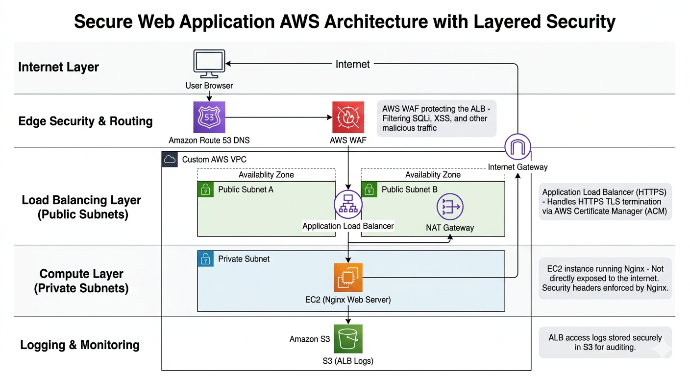
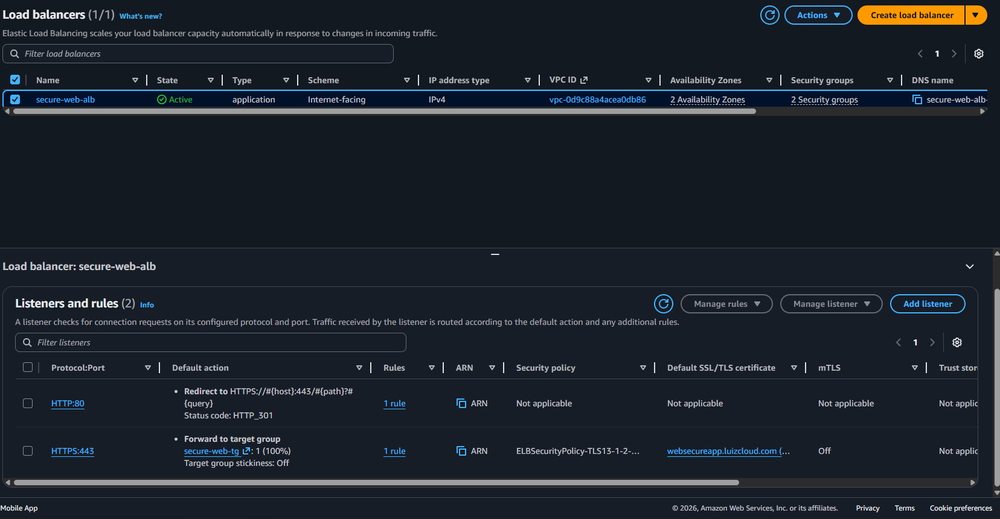
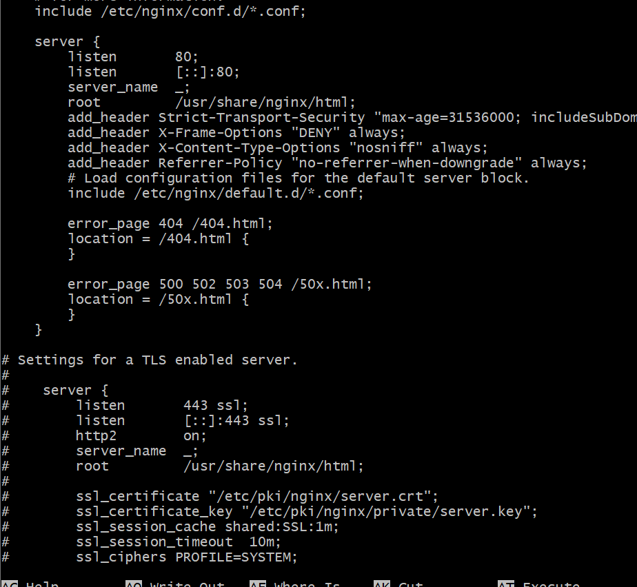
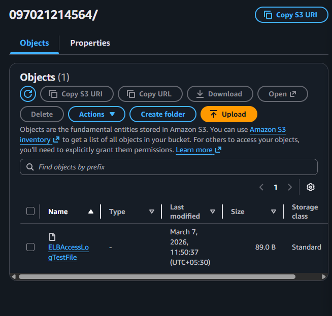
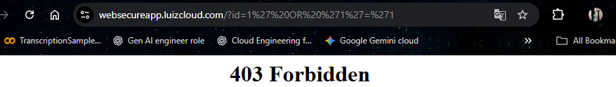
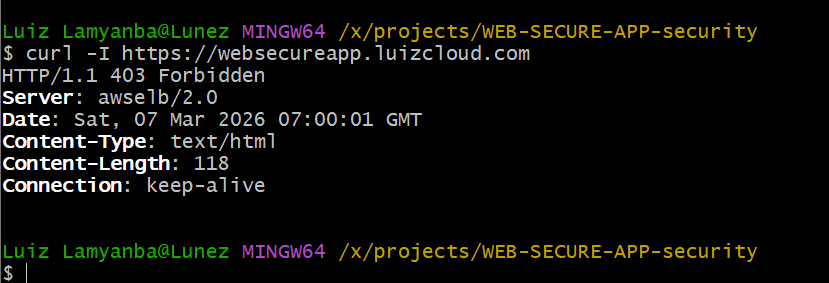
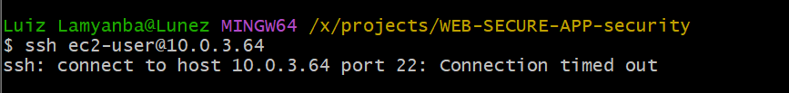

# Secure Web Architecture on AWS

> A production-grade, defense-in-depth web application architecture using AWS WAF, ALB, and private subnet isolation.

---

## Overview

This project demonstrates the design and deployment of a **secure, scalable web application architecture on AWS**, built around industry-standard cloud security principles.

The backend web server is **never directly exposed to the internet**. Instead, all traffic flows through controlled, monitored entry points — minimizing the attack surface while maintaining full availability to legitimate users.

### Core Security Principles

- **Defense in depth** — multiple independent security layers
- **Least privilege networking** — private subnet isolation for compute resources
- **Encrypted communication** — TLS enforced end-to-end via ACM
- **Web Application Firewall** — managed rule sets blocking common attack patterns
- **Centralized logging** — ALB access logs stored in S3 for audit and forensic use

---

## Architecture

[Architecture readme](architecture/Architecture.md)

### Design Decisions

| Layer | Component | Purpose |
|---|---|---|
| DNS | Amazon Route 53 | Domain resolution and routing |
| Firewall | AWS WAF | Application-layer threat filtering |
| Load Balancer | ALB (HTTPS) | TLS termination, traffic distribution |
| Compute | EC2 (private subnet) | Web server, isolated from internet |
| Certificate | AWS ACM | Managed TLS certificate |
| Logging | Amazon S3 | Access log storage and analysis |

---

## Tech Stack

**Cloud Infrastructure**
- AWS VPC (custom, with public/private subnets)
- Amazon EC2
- Application Load Balancer (ALB)
- AWS WAF
- AWS Certificate Manager (ACM)
- Amazon Route 53
- Amazon S3
- AWS NAT Gateway

**Web Server**
- Nginx

**Security Controls**
- HTTPS enforcement with HTTP → HTTPS redirect
- WAF managed rule groups
- HTTP security headers
- Private subnet architecture
- ALB access logging

---
### 8. IAM Role for Secure Instance Management

To securely manage the EC2 instance without exposing SSH access, an IAM role was attached to the instance enabling **AWS Systems Manager (SSM)** access.

This allows administrators to connect to the instance through the AWS console without opening port 22.

**Key Security Benefits**

- No SSH keys required
- No inbound SSH port exposure
- Access controlled via AWS IAM policies
- Session activity can be logged and audited

The instance role includes the following AWS managed policy:

- `AmazonSSMManagedInstanceCore`

The trust policy allows the EC2 service to assume the role.


Detailed IAM configuration and policy files are documented in the **** of this repository.

## Deployment Walkthrough

### 1. Domain & DNS

- Domain registered via GoDaddy
- DNS managed through **Amazon Route 53**
- Subdomain configured for the application:

```
https://websecureapp.luizcloud.com
```


---

### 2. VPC & Network Architecture

A custom VPC was provisioned with the following structure:

- **2 public subnets** — for the Application Load Balancer
- **1 private subnet** — for the EC2 instance (no direct internet access)
- **Internet Gateway** — for outbound traffic from public subnets
- **NAT Gateway** — allows the private EC2 instance to reach the internet outbound (e.g., for updates)
- **Route tables** — configured per subnet to enforce network flow

This design ensures the backend server is **fully isolated from inbound internet traffic**.


---

### 3. EC2 Instance

- Amazon Linux instance deployed inside the private subnet
- **Nginx** installed and configured as the web server


- Instance accessed securely via **AWS Systems Manager (SSM)** — no SSH key or bastion host required

---

### 4. Application Load Balancer

- HTTPS listener on **port 443**
- TLS certificate provisioned and managed by **AWS Certificate Manager**


- HTTP traffic on port 80 automatically redirected to HTTPS
- Target group routes traffic to the EC2 instance




---

### 5. AWS WAF Configuration

WAF was configured with the following AWS Managed Rule Groups:

- **Core Rule Set** — common web exploits (OWASP Top 10)
- **SQL Injection Protection** — blocks SQLi patterns in requests
- **Known Bad Inputs** — filters known malicious payloads
- **Bot Control** — detects and blocks automated/non-browser traffic


---

### 6. Nginx Security Headers

The following HTTP response headers were configured in Nginx to harden the application:

```nginx
add_header Strict-Transport-Security "max-age=31536000; includeSubDomains" always;
add_header X-Frame-Options "DENY" always;
add_header X-Content-Type-Options "nosniff" always;
add_header Referrer-Policy "no-referrer" always;
```

| Header | Mitigates |
|---|---|
| `Strict-Transport-Security` | Protocol downgrade attacks, cookie hijacking |
| `X-Frame-Options` | Clickjacking |
| `X-Content-Type-Options` | MIME-type sniffing |
| `Referrer-Policy` | Referrer information leakage |




snippet of nginx conf inside ssm

---

### 7. Logging

ALB access logging was enabled and configured to write to a dedicated **Amazon S3 bucket**.

Each log entry includes:

- Client IP address
- Request path and method
- HTTP response status code
- Timestamp
- User-agent string




This provides a full audit trail for traffic analysis and security investigations.

---

## Security Testing

### SQL Injection — Blocked by WAF

**Request:**
```
GET https://websecureapp.luizcloud.com/?id=1' OR '1'='1
```

**Response:**
```
HTTP 403 Forbidden

```


The WAF SQL injection rule set detected and blocked the request before it reached the origin.

---

### Bot Detection — Blocked by WAF

Automated requests sent via `curl` were blocked by the **AWS WAF Bot Control** rule group, confirming that non-browser traffic is correctly identified and rejected.


---

### HTTPS Validation

TLS certificate verified via browser inspection — issued and managed through **AWS Certificate Manager** with no certificate warnings.

### SSH Access Restriction — Port 22 Disabled

Direct SSH access to the EC2 instance is intentionally disabled to reduce the attack surface.
Instead of allowing inbound SSH (port 22), the instance is accessed securely using **AWS Systems Manager Session Manager (SSM)**.

**Security Configuration**

- No inbound rule for port **22 (SSH)** in the EC2 security group
- Instance deployed in a **private subnet**
- Administrative access performed through **AWS Systems Manager**



Attempting to connect to the instance via SSH results in a connection failure.

---

## Tradeoffs & Considerations

**TLS Termination at the ALB**

TLS is terminated at the load balancer, meaning traffic between the ALB and EC2 travels over HTTP inside the VPC. This is an accepted tradeoff since communication occurs within a **private, trusted network boundary**. End-to-end encryption to the instance could be implemented if compliance requirements demand it.

**Bot Control Rules**

Enabling the WAF Bot Control rule group may block legitimate command-line tools (e.g., `curl`, `wget`). This is expected behavior and an acceptable tradeoff for automated traffic protection.

**NAT Gateway Cost**

NAT Gateways incur an hourly charge plus data transfer costs. This cost is justified by the security benefit of keeping the EC2 instance in a private subnet.

---

## Key Takeaways

This project provided hands-on experience with:

- Designing layered cloud security architectures on AWS
- Implementing network isolation with public/private subnets
- Managing TLS certificates with AWS Certificate Manager
- Configuring AWS WAF managed rule groups
- Hardening web servers with HTTP security headers
- Analyzing traffic through ALB access logs
- Accessing private instances securely using AWS SSM

---

## Future Improvements

**Amazon CloudFront Integration**

Adding a CDN layer would provide edge-level security, DDoS mitigation via AWS Shield, and improved global latency.

**Infrastructure as Code**

Automate provisioning and ensure reproducibility using:
- Terraform
- AWS CloudFormation

**Extended Security Monitoring**

Integrate additional AWS security services:
- **AWS GuardDuty** — threat detection
- **AWS Security Hub** — centralized security posture management
- **AWS CloudTrail** — API audit logging

**Log Analysis with Amazon Athena**

Query ALB access logs stored in S3 using Athena for traffic pattern analysis and anomaly detection without exporting data.

---

## Author

**Luiz Lamyanba**

Cloud & Security Engineering student documenting real-world, hands-on projects in cloud infrastructure and security.
