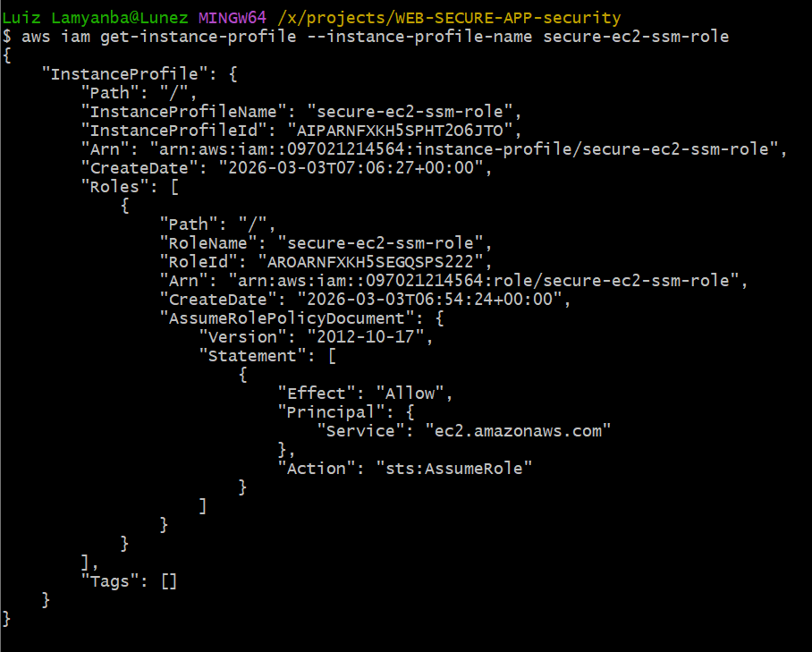

# IAM Configuration — Secure EC2 Access via AWS Systems Manager

## Overview

This document describes the IAM configuration used to manage the EC2 instance securely, without exposing SSH access or maintaining static credentials.

Rather than allowing direct SSH connections, the instance is accessed exclusively through **AWS Systems Manager (SSM) Session Manager**. This approach eliminates the operational and security overhead of SSH key management while providing a fully auditable access path.

---

## Why SSM Instead of SSH?

Traditional EC2 access relies on SSH, which requires:

- An open inbound rule on port 22
- SSH key pairs that must be generated, distributed, and rotated
- A bastion host or VPN for instances in private subnets

SSM Session Manager removes all of these requirements. The EC2 instance sits in a **private subnet with no inbound internet access** — SSM communicates outbound over HTTPS through the NAT Gateway, so no inbound ports need to be opened at all.

---

## IAM Role

| Field | Value |
|---|---|
| **Role Name** | `secure-ec2-ssm-role` |
| **Role Type** | AWS Service Role |
| **Trusted Service** | `ec2.amazonaws.com` |
| **Purpose** | Grants the EC2 instance permission to register with and communicate with AWS Systems Manager |

The role is attached to the EC2 instance as an **Instance Profile**, which allows the instance itself (rather than a human user) to authenticate to AWS services automatically using temporary, short-lived credentials.

---

## Attached Policy

**Policy Name:** `AmazonSSMManagedInstanceCore`
**Type:** AWS Managed Policy
**ARN:** `arn:aws:iam::aws:policy/AmazonSSMManagedInstanceCore`

This policy grants the EC2 instance the minimum permissions required to function as a managed SSM node:

| Permission | Purpose |
|---|---|
| `ssm:DescribeAssociation` | Retrieve association details from SSM |
| `ssm:GetDeployablePatchSnapshotForInstance` | Access patch management data |
| `ssm:GetDocument` | Download SSM documents for execution |
| `ssm:ListAssociations` | List applied associations |
| `ssm:UpdateInstanceInformation` | Register and heartbeat with SSM |
| `ssmmessages:*` | Enable Session Manager connectivity |
| `ec2messages:*` | Enable Run Command and session messaging |
| `s3:GetObject` (scoped) | Download patch baselines and related content |

This is an **AWS-maintained managed policy**, meaning AWS updates it automatically as SSM adds new features — no manual policy maintenance required.

---

## Trust Policy

The trust policy defines which entity is permitted to assume this IAM role. In this case, only the EC2 service can assume the role — meaning the credentials are automatically issued to the instance at launch and rotated by AWS.

```json
{
  "Version": "2012-10-17",
  "Statement": [
    {
      "Effect": "Allow",
      "Principal": {
        "Service": "ec2.amazonaws.com"
      },
      "Action": "sts:AssumeRole"
    }
  ]
}
```

> **Note:** No IAM user or external account is trusted in this policy. Only the EC2 service itself can assume the role, scoped to instances that have the Instance Profile explicitly attached.

---

## Instance Profile

An **Instance Profile** is the container that carries the IAM role to the EC2 instance. When the instance launches, it retrieves temporary credentials from the EC2 Instance Metadata Service (IMDS) at:

```
http://169.254.169.254/latest/meta-data/iam/security-credentials/secure-ec2-ssm-role
```

These credentials are automatically rotated by AWS — no manual key rotation is needed.

| Field | Value |
|---|---|
| **Instance Profile Name** | `secure-ec2-ssm-role` |
| **Attached Role** | `secure-ec2-ssm-role` |
| **Attached to Instance** | EC2 instance in private subnet |

---

## Session Manager Access Flow

```
Administrator
      │
      ▼
AWS Console / AWS CLI
      │
      ▼
IAM Authentication (human user or role)
      │
      ▼
SSM Session Manager API
      │
      ▼  (outbound HTTPS via NAT Gateway)
EC2 Instance (private subnet)
      │
      ▼
SSM Agent (installed on instance)
      │
      ▼
Interactive Shell Session
```

The EC2 instance initiates the outbound connection to SSM — no inbound rule is required on the instance's Security Group.

---


## Security Group Configuration

Because SSM Session Manager does not require inbound connectivity, the EC2 Security Group is configured with **zero inbound rules** for administrative access.

| Direction | Port | Source | Purpose |
|---|---|---|---|
| Inbound | — | — | No SSH or admin ports open |
| Inbound | (application traffic from ALB only) | ALB Security Group | Web traffic |
| Outbound | 443 | `0.0.0.0/0` | SSM communication, AWS APIs |

Port 22 is not open. There is no bastion host.

---

## Audit Logging

All Session Manager sessions are automatically logged through **AWS CloudTrail**, capturing:

- **Who** initiated the session (IAM identity)
- **When** the session started and ended
- **What** commands were executed (if session logging to S3/CloudWatch is enabled)

To enable full command-level logging, configure the SSM Session Manager preferences to stream session output to **Amazon S3** or **Amazon CloudWatch Logs**.

---

## Security Advantages

| Approach | SSH | SSM Session Manager |
|---|---|---|
| Inbound port required | Port 22 open | None |
| Credential type | Long-lived SSH key files | Temporary IAM credentials (auto-rotated) |
| Key distribution | Manual | Not required |
| Access control | Key possession | IAM policies and permissions |
| Audit trail | Optional (syslog) | AWS CloudTrail (automatic) |
| Works in private subnets | Requires bastion host | Yes, natively |
| MFA support | Not native | Yes, via IAM policy conditions |

Using IAM + SSM eliminates an entire category of risk associated with credential management and network exposure.

---

## Least Privilege Notes

The `AmazonSSMManagedInstanceCore` managed policy was chosen because it provides exactly the permissions required for SSM connectivity — nothing more. No `AdministratorAccess` or broad IAM permissions are granted to the instance role.

If the instance requires access to additional AWS services (e.g., S3 for log delivery), those permissions should be added as **separate, narrowly scoped inline or managed policies** rather than broadening the existing role.